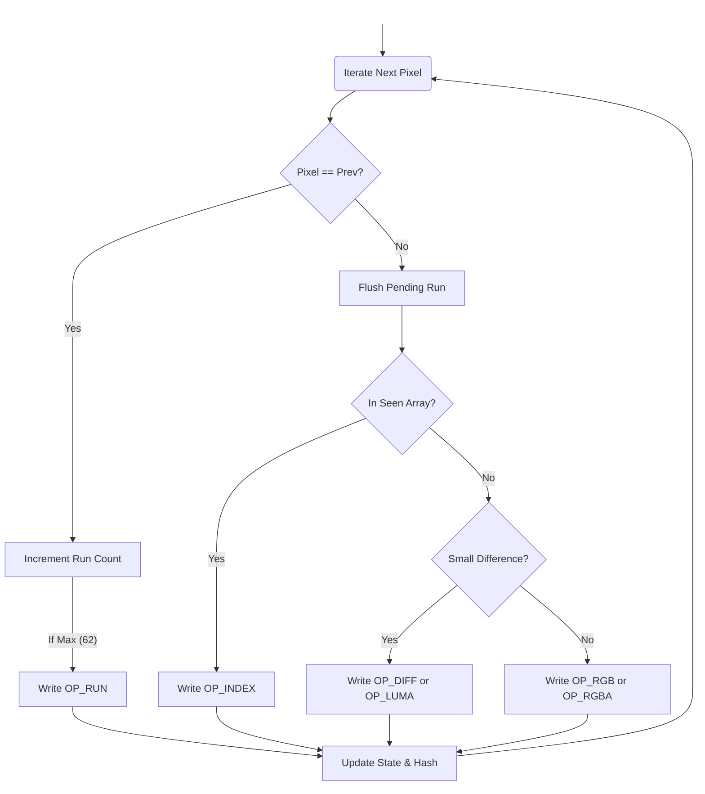
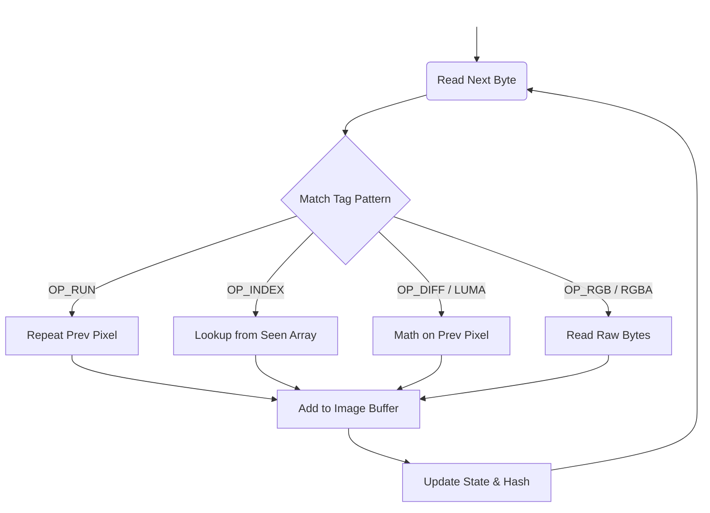

---
<br/>

**A modular, pure Rust implementation of the Quite OK Image Format.**

`qoi-codec` is a high-performance command-line tool and library designed to encode standard images (`.avif`, `.bmp`, `.dds`, `.exr`, `.ff`, `.gif`, `.hdr`, `.ico`, `.jpeg`, `.png`, `.pnm`, `.tga`, `.tiff`, `.webp`) into `.qoi` and decode `.qoi` files back into standard formats. It prioritizes code readability and modular architecture while maintaining the blazing fast speeds defined by the QOI specification.

---

## Table of Contents
- [🧐 What is QOI?](#-what-is-qoi)
- [📥 Installation](#-installation)
- [🚀 Usage](#-usage)
- [🏗 Architecture](#-architecture)
  - [Encoder Loop](#encoder-loop)
  - [Decoder Loop](#decoder-loop)
  - [File Tree](#file-tree)
  - [🧩 Structs & Enums](#-structs--enums)
- [🔗 Dependencies](#-dependencies)
- [📄 License](#-license)

---

## 🧐 What is QOI?

The **Quite OK Image Format (QOI)** is a modern, lossless image compression format created by Dominic Szablewski. It was designed to be a counterpoint to complex formats like PNG, JPEG, and WEBP.

Unlike PNG, which relies on complex filtering and DEFLATE compression, QOI uses a simple, streaming data compression algorithm based on:
1.  **O(n) Complexity:** Like all modern formats, it has a linear time complexity. But, it requires far less operations per pixel than other formats.
2.  **Run-Length Encoding:** Repeated pixels are encoded using no. of repetitions i.e. run-length. (`QOI_OP_RUN`).
3.  **Color Indexing:** A rolling array of the 64 most recently seen colors allows for single-byte references (`QOI_OP_INDEX`).
4.  **Delta Encoding:** Small changes in hue are stored as tiny differences (`QOI_OP_DIFF` & `QOI_OP_LUMA`), rather than storing full RGB values.

The result is a format that compresses at similar ratios to PNG but encodes 20x-50x faster and decodes 3x-4x faster.

---

## 📥 Installation

### Option 1: Pre-built Binaries (Recommended)
You do not need Rust installed to use this tool. Simply download the executable for your operating system from the **[Releases Page](../../releases)**.

1.  Download the binary for **Windows**, **Linux**, or **macOS**.
2.  Run it directly from your terminal.

### Option 2: Build from Source
To build the project yourself, ensure you have the [Rust Toolchain](https://www.rust-lang.org/) (2024 edition) installed.

```bash
git clone https://github.com/your-username/qoi-codec.git
cd qoi-codec
cargo build --release
```

---

## 🚀 Usage

The CLI automatically infers the desired output format based on the file extension provided.

```bash
# Syntax
./qoi-codec [FLAGS] <INPUT_FILE> <OUTPUT_FILE>
```

### Flags
*   `-e`, `--encode`: Compress an image (PNG, JPG, etc.) into a `.qoi` file.
*   `-d`, `--decode`: Decompress a `.qoi` file into a standard format (PNG, JPG, etc.).
*   `-h`, `--help`: View the help menu.

### Examples

**Encoding (PNG → QOI)**
```bash
./qoi-codec -e raw_screenshot.png converted.qoi
```

**Decoding (QOI → JPG)**
```bash
./qoi-codec -d converted.qoi output.jpg
```

---

## 🏗 Architecture

Unlike monolithic implementations, `qoi-codec` is architected to separate the state machine from the chunk processing logic. This makes the codebase easier to audit and maintain.

### Encoder Loop


### Decoder Loop


### File Tree
```text
.
├── main.rs                 # CLI Entry point
├── state.rs                # QOI State Machine & Lookup Table
├── tags.rs                 # QOI Byte Tags
├── decoder
│   ├── chunks.rs           # Byte parsing
│   ├── core.rs             # Decoder loop
│   └── header.rs           # Header validation
└── encoder
    ├── core.rs             # Encoder loop
    ├── diff_handler.rs     # Logic for small diffs / luma diffs
    ├── run_handler.rs      # Logic for run-length encoding
    ├── seen_handler.rs     # Logic for index lookups
    ├── normal_handler.rs   # Fallback for full RGB/RGBA writing
    └── image_buffer.rs     # Logic for pushing the encoded chunks into buffer
```

### 🧩 Structs & Enums

#### `QOIState`
Syncs the encoder and decoder context.

```rust
struct QOIState {
    prev_pixel: Rgba<u8>,
    seen_pixels: Vec<Rgba>,
    run_length: u8,
}
```

#### `PixelChunk`
Intermediate format for parsed QOI tags.

```rust
enum PixelChunk {
    RGB(u8, u8, u8),
    RGBA(u8, u8, u8, u8),
    Index(u8),
    Diff(u8, u8, u8),
    Luma(u8, u8, u8),
    Run(u8),
}
```

#### `QOIHeader`
The 14-byte file header.

```rust
struct QOIHeader {
    width: u32,
    height: u32,
    channels: u8,
    colorspace: u8,
}
```

#### `QOIError`
Project-wide error handling.

```rust
enum QOIError {
    FileReadError,
    FileWriteError,
    ImageDecodeError(String),
    InvalidArgs(String),
    ImageTooLarge,
}
```

---

## 🔗 Dependencies
* `image` [crate](https://crates.io/crates/image): For decoding standard formats into raw pixel data.

---

## 📄 License

This project is licensed under the [MIT License](LICENSE).
